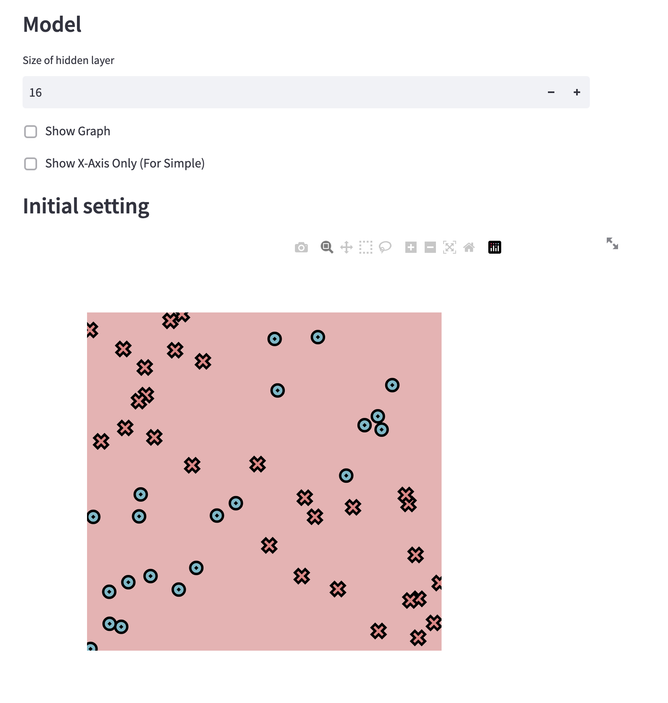

[](https://classroom.github.com/a/YFgwt0yY)
# MiniTorch Module 2


* Docs: https://minitorch.github.io/

* Overview: https://minitorch.github.io/module2/module2/

This assignment requires the following files from the previous assignments. You can get these by running

```bash
python sync_previous_module.py previous-module-dir current-module-dir
```

The files that will be synced are:

        minitorch/operators.py minitorch/module.py minitorch/autodiff.py minitorch/scalar.py minitorch/scalar_functions.py minitorch/module.py project/run_manual.py project/run_scalar.py project/datasets.py


# Task2.5
## Simple
### Data points: 50
### Hidden Layers: 2
### Learning Rate: 0.5
### Time per epoch: 0.105s
### Epoch: 500


## Diag
### Data points: 50
### Hidden Layers: 2
### Learning Rate: 10.5
### Time per epoch: 0.107s
### Epoch: 500


## Split
### Data points: 50
### Hidden Layers: 6
### Learning Rate: 0.5
### Time per epoch: 0.321s
### Epoch: 500


## Xor
### Data points: 50
### Hidden Layers: 16
### Learning Rate: 0.1
### Time per epoch: 1.589s
### Epoch: 3000



